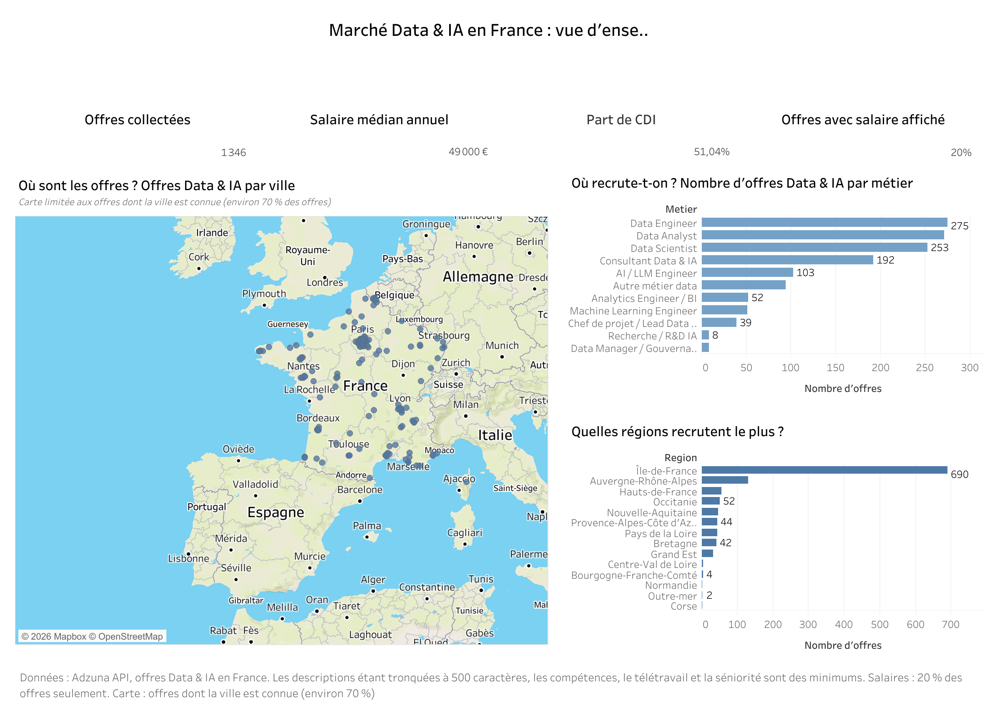
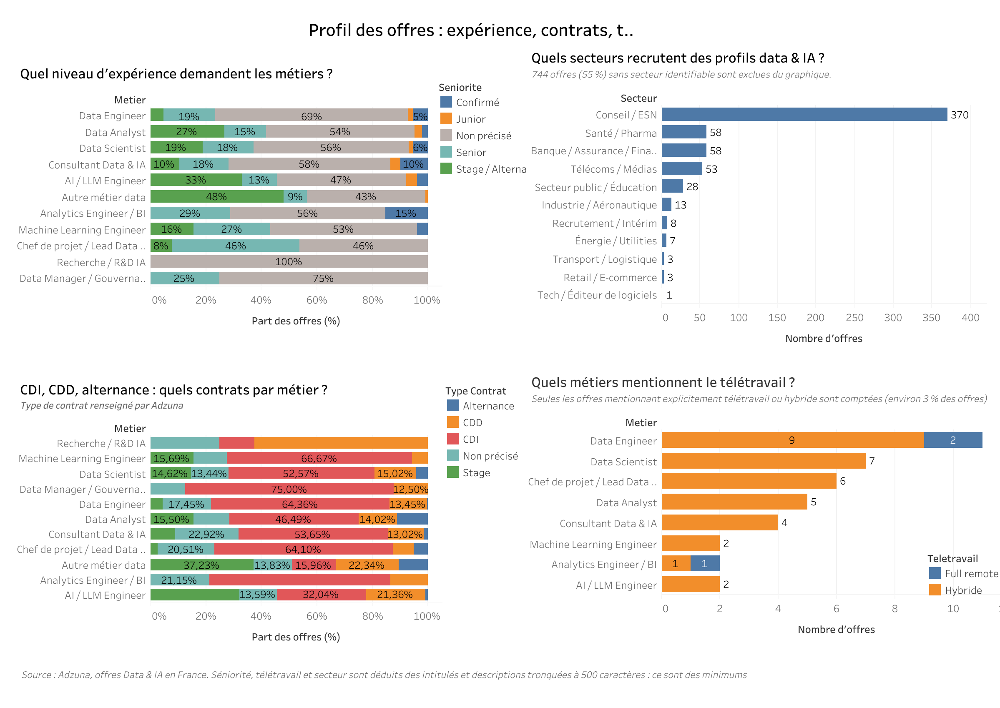
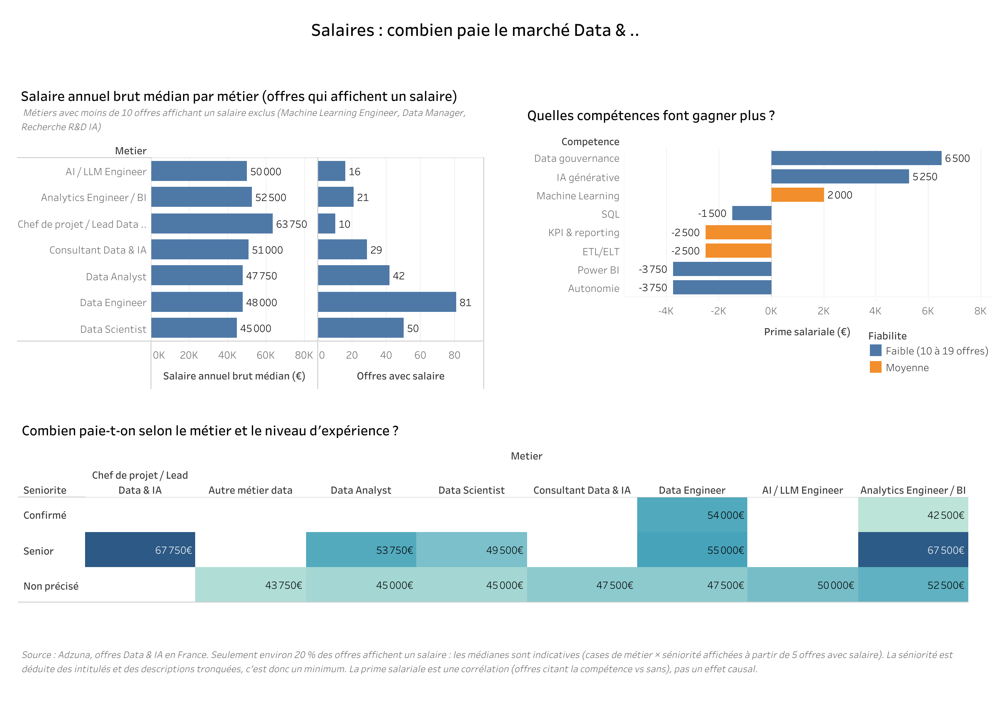
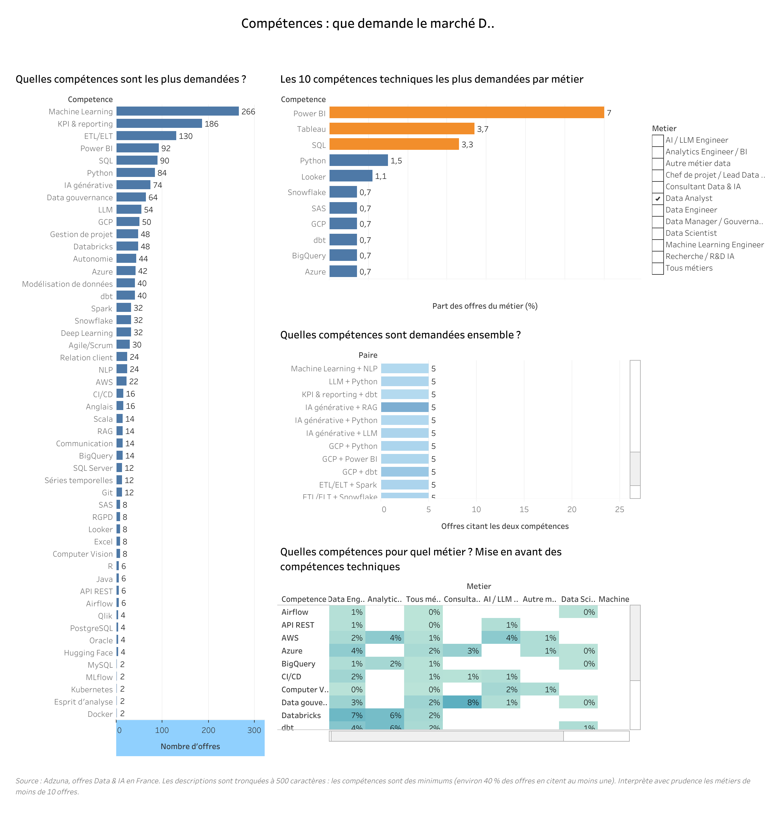

# Job Market Intelligence — Data & IA en France

[](https://github.com/HodaFede/job-market-intelligence/actions/workflows/tests.yml)

Que demandent vraiment les recruteurs Data et IA en France ? Ce projet collecte des offres d'emploi, les nettoie, en extrait les compétences par NLP, les modélise en SQL et les restitue dans quatre tableaux de bord **Tableau Public**.

**[Voir les tableaux de bord sur Tableau Public](https://public.tableau.com/views/JobMarketIntelligence_17914989320550/D1Vuedensemble)** · [Rapport d'analyse](reports/insights.md) · [Limites connues](#limites-à-connaître-avant-de-lire-les-chiffres)

> **Données figées au 6 octobre 2026.** Les chiffres ci-dessous viennent de 1 346 offres réelles collectées via l'API Adzuna (publications d'octobre 2025 à octobre 2026). La collecte automatique est désactivée en attendant la prochaine mise à jour.

## Ce que montrent les données

- **1 346 offres** Data & IA, **51 %** en CDI, avec un **salaire médian annuel brut de 49 000 €** (calculé sur les seules offres qui affichent un salaire, soit environ 20 % d'entre elles).
- **Métiers** : Data Engineer (275 offres), Data Analyst, Data Scientist (253) et Consultant Data & IA (192) concentrent l'essentiel des offres.
- **Géographie** : 690 offres sont en Île-de-France. La carte ne place que les offres dont la ville est connue (environ 70 %).
- **Secteurs** : sur les 602 offres dont le secteur est identifiable, 370 viennent du conseil et des ESN.
- **Salaires** : les médianes par métier vont de 45 000 € (Data Scientist) à 52 500 € (Analytics Engineer / BI), avec 47 750 € pour les Data Analyst. Les écarts sont indicatifs : peu d'offres affichent un salaire.
- **Compétences les plus citées** : Machine Learning (266 offres), KPI & reporting (186), ETL/ELT (130), Power BI (92), SQL (90) et Python (84).

## Les quatre tableaux de bord

Le classeur contient 18 feuilles Tableau (F01 à F18), assemblées en quatre tableaux de bord de 1 200 px de large.

### D1 — Vue d'ensemble

Quatre indicateurs (offres collectées, salaire médian, part de CDI, part d'offres avec salaire), la carte des offres, le nombre d'offres par métier et par région.



### D2 — Profil des offres

Niveau d'expérience demandé par métier, types de contrat, offres qui mentionnent le télétravail, secteurs qui recrutent.



### D3 — Salaires

Salaire annuel brut médian par métier, médiane par métier et séniorité (cases affichées à partir de 5 offres avec salaire), et écart de salaire médian entre offres qui citent une compétence et offres qui ne la citent pas.



### D4 — Compétences

Compétences les plus demandées, top 10 par métier (filtre sur le métier), compétences demandées ensemble, et carte de chaleur compétences × métiers.



## Limites à connaître avant de lire les chiffres

- **Descriptions tronquées à 500 caractères** par Adzuna : les compétences, le télétravail et la séniorité sont des **valeurs minimales**. Environ 40 % des offres citent au moins une compétence ; Power BI n'apparaît que dans 7 % des offres Data Analyst. Les comparaisons entre compétences restent utiles, pas les niveaux absolus.
- **Salaires** : environ 20 % des offres seulement en affichent un. Les médianes par métier et séniorité sont indicatives ; les métiers de moins de 10 offres avec salaire sont exclus du graphique.
- **Secteur inconnu** pour 55 % des offres (744), **région inconnue** pour 14 % (194).
- **Prime salariale** : c'est une corrélation (offres qui citent la compétence contre offres qui ne la citent pas), pas un effet causal.
- **Métiers de moins de 10 offres** (Recherche / R&D IA, Data Manager) : les pourcentages sont peu fiables.
- Une offre publiée n'est pas une embauche, et la séniorité est déduite du texte de l'offre.

## Ce que montre le projet

| Compétence | Où la voir |
|---|---|
| Collecte (API, scraping) | `src/jmi/collect/` : API Adzuna (source des données publiées), API France Travail (optionnelle, non utilisée pour les chiffres ci-dessus), scraper JSON-LD schema.org qui respecte robots.txt |
| Nettoyage (pandas) | `src/jmi/clean/` : salaires multi-formats ramenés à un annuel brut, villes → région + coordonnées, séniorité, métier, télétravail, déduplication |
| NLP | `src/jmi/nlp/skills.py` : extraction de 75 compétences par dictionnaire et regex (faux positifs du français gérés), TF-IDF par métier |
| SQL | `sql/` : modèle relationnel SQLite et vues analytiques (CTE, fonctions de fenêtrage, médianes et quartiles, co-occurrences et lift) |
| Dataviz | `exports/tableau/` + [guide Tableau Public](docs/tableau_guide.md) : 18 feuilles, 4 tableaux de bord |
| Exploration (EDA) | [`notebooks/01_exploration_qualite.ipynb`](notebooks/01_exploration_qualite.ipynb) : contrôle qualité, distributions |
| Analyse métier | [`reports/insights.md`](reports/insights.md), [`docs/business_analysis.md`](docs/business_analysis.md) |
| Qualité | 133 tests pytest, lancés par GitHub Actions à chaque push |

## Pipeline

```
Collecte (API Adzuna)       →  data/raw/*.jsonl
      ↓
Nettoyage & normalisation   →  data/processed/offers_clean.csv
      ↓
NLP compétences + TF-IDF    →  data/processed/offer_skills.csv
      ↓
SQLite + vues SQL           →  data/warehouse/jobs.db
      ↓
Exports CSV                 →  exports/tableau/*.csv  →  Tableau Public
      ↓
Rapport d'analyse           →  reports/insights.md
```

Détails : [docs/architecture.md](docs/architecture.md).

## Démarrage rapide (Mac)

Prérequis : Python 3.10+ (`python3 --version`), Git, et un compte [Tableau Public](https://public.tableau.com) pour la visualisation.

```bash
git clone https://github.com/HodaFede/job-market-intelligence.git
cd job-market-intelligence
make install                 # crée .venv et installe les dépendances
source .venv/bin/activate

# Option A — tout de suite, avec le jeu de démonstration synthétique
python -m jmi demo
python -m jmi run

# Option B — données réelles (identifiants Adzuna gratuits, voir docs/data_collection.md)
cp .env.example .env         # renseigner ADZUNA_APP_ID et ADZUNA_APP_KEY
python -m jmi collect
python -m jmi run

pytest                       # tests
```

Sans `make` : `python3 -m venv .venv && source .venv/bin/activate && pip install -r requirements.txt && pip install -e .`

Le jeu de démonstration (colonne `est_demo = 1`) permet de faire tourner le pipeline sans clé d'API ; il n'est jamais mélangé aux données réelles par défaut.

## Automatisation

- `.github/workflows/tests.yml` : tests à chaque push et pull request (Python 3.10 et 3.12).
- `.github/workflows/weekly_collect.yml` : collecte, pipeline, puis commit des exports. **Désactivé pour l'instant** : pour le réactiver, ajouter `ADZUNA_APP_ID` et `ADZUNA_APP_KEY` dans les secrets du dépôt.

## Exports pour Tableau

| Fichier | Contenu |
|---|---|
| `offres.csv` | une ligne par offre (métier, séniorité, ville, coordonnées, salaire, télétravail, contrat, date) |
| `offres_competences.csv` | compétences détectées par offre, à relier sur `id_offre` |
| `kpi_globaux.csv` | indicateurs d'en-tête |
| `salaires_metier_seniorite.csv` | médiane, quartiles et fiabilité par métier × séniorité |
| `competences_par_metier.csv` | part des offres qui citent chaque compétence, par métier |
| `prime_salariale_competences.csv` | salaire médian avec / sans chaque compétence |
| `paires_competences.csv` | co-occurrences et lift |
| `villes.csv`, `secteurs.csv` | synthèses géographique et sectorielle |
| `tendance_mensuelle.csv`, `teletravail_metier.csv`, `seniorite_metier.csv`, `contrats.csv` | répartitions |
| `termes_tfidf.csv` | vocabulaire caractéristique de chaque métier |

Colonnes détaillées : [docs/data_dictionary.md](docs/data_dictionary.md). Définitions des indicateurs : [docs/kpis.md](docs/kpis.md).

## Structure

```
.github/         workflows GitHub Actions (tests, collecte)
config/          paramètres, référentiel de compétences, référentiel de villes
data/            brut, nettoyé, base SQLite (non versionné)
docs/            architecture, collecte, KPIs, NLP, guide Tableau, analyse métier, images
exports/tableau/ CSV pour Tableau Public
notebooks/       exploration et contrôle qualité
reports/         rapport d'insights généré
sql/             schéma + vues analytiques
src/jmi/         code Python (collect, clean, nlp, warehouse, export, analysis)
tests/           tests pytest + fixtures
```

## Choix de conception

- NLP volontairement explicable (dictionnaire + regex + TF-IDF) : chaque chiffre se retrace jusqu'à la règle qui l'a produit.
- Médiane plutôt que moyenne pour les salaires : la distribution est asymétrique.
- Collecte respectueuse : API officielle en priorité, aucune donnée personnelle, descriptions d'offres non republiées.
- Les limites sont écrites sur les tableaux de bord eux-mêmes (notes de bas de page), pas seulement ici.

## Documentation

- [Architecture](docs/architecture.md)
- [Collecte des données](docs/data_collection.md)
- [Dictionnaire des données](docs/data_dictionary.md)
- [Indicateurs](docs/kpis.md)
- [NLP compétences](docs/nlp_skills.md)
- [Guide Tableau Public](docs/tableau_guide.md)
- [Analyse métier](docs/business_analysis.md)

## Auteure

**Hoda Fede Ndinge** — Data Analyst, Mastère Data & IA (IPSSI Paris)
