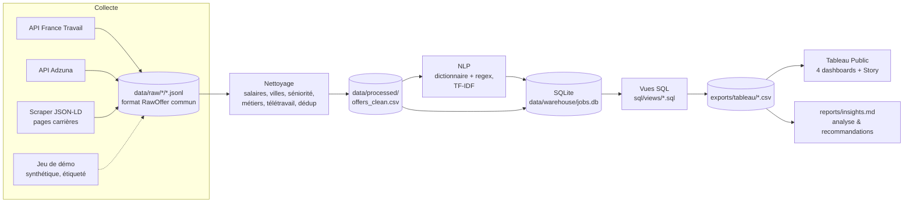
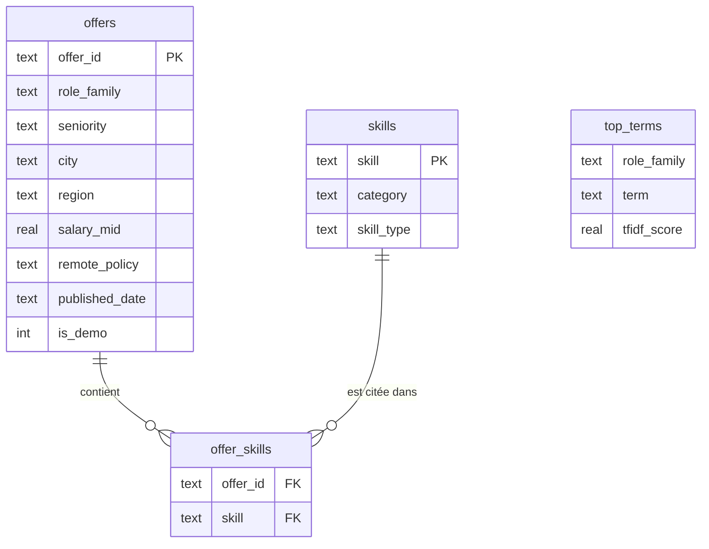

# Architecture

## Flux de données



Une commande par étape : `python -m jmi collect` (ou `demo`), puis `python -m jmi run` pour tout le reste.

## Arborescence

```
job-market-intelligence/
├── .github/workflows/           # tests.yml (CI), weekly_collect.yml (collecte planifiée)
├── config/
│   ├── settings.yaml            # mots-clés, sources, chemins, seuils de nettoyage
│   ├── skills_dictionary.yaml   # référentiel NLP des compétences
│   ├── cities_fr.csv            # référentiel villes → région, coordonnées
│   └── scrape_urls.txt          # pages d'offres à scraper (JSON-LD)
├── data/                        # non versionné (régénérable)
│   ├── raw/<source>/*.jsonl     # collecte brute horodatée, jamais modifiée
│   ├── processed/               # offers_clean.csv, offer_skills.csv
│   └── warehouse/jobs.db        # base SQLite
├── exports/tableau/             # CSV prêts pour Tableau Public (versionnés)
├── reports/insights.md          # rapport d'analyse généré
├── sql/
│   ├── schema.sql               # modèle relationnel
│   └── views/NN_nom.sql         # une vue = un export nom.csv
├── src/jmi/
│   ├── cli.py                   # python -m jmi collect | demo | run | all
│   ├── config.py
│   ├── pipeline.py              # orchestration run
│   ├── collect/                 # base (HTTP poli, JSONL), france_travail, adzuna, jsonld_scraper, demo
│   ├── clean/                   # normalize (fonctions pures), transform (DataFrame propre)
│   ├── nlp/skills.py            # extraction de compétences, TF-IDF
│   ├── warehouse/load.py        # chargement SQLite + vues
│   ├── export/tableau.py        # vues → CSV
│   └── analysis/report.py       # insights et recommandations
├── notebooks/                   # exploration et contrôle qualité (Jupyter)
├── tableau/                     # classeur .twbx (copie locale)
├── tests/                       # pytest + fixtures d'API réalistes
├── docs/                        # cette documentation
├── Makefile, pyproject.toml, requirements.txt, requirements-dev.txt, .env.example
└── README.md
```

## Modèle de données SQLite



`pipeline_runs` garde une trace de chaque exécution (date, jeu réel ou démo, volumes).

## Choix de conception

- **Un format brut commun (`RawOffer`)** : chaque collecteur ne fait que traduire sa source ; tout le parsing (salaires, lieux…) est centralisé dans `clean/normalize.py` et testé une fois pour toutes les sources.
- **Brut immuable** : `data/raw` n'est jamais réécrit, chaque collecte ajoute un fichier horodaté. On peut rejouer le nettoyage à volonté.
- **Réel prioritaire sur la démo** : en mode `auto`, dès qu'une offre réelle existe, le jeu synthétique est ignoré. Les deux ne sont mélangés que sur demande explicite (`--data-mode all`), et chaque ligne porte `is_demo`.
- **SQL pour les agrégats** : médianes, quartiles, co-occurrences et lift sont calculés dans des vues versionnées, lisibles et testées, plutôt que cachés dans Tableau.
- **CSV pour Tableau Public** : l'application ne lit pas SQLite ; UTF-8, virgule, dates ISO, colonnes en français pour des libellés propres côté dashboard.
- **Collecte polie** : User-Agent explicite, délais, retries exponentiels sur 429/5xx, robots.txt vérifié avant tout scraping.
